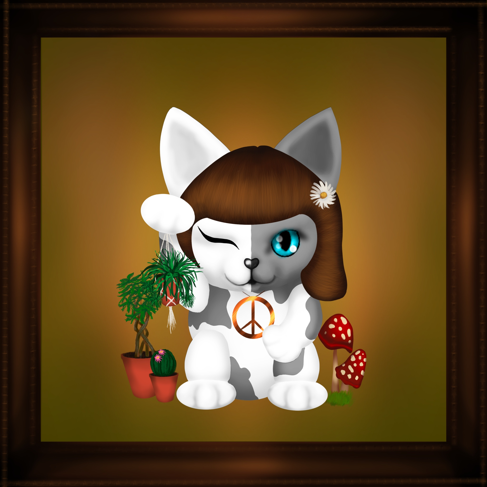

# Retro Cats

<br/>
<p align="center">

</p>
<br/>

- [Retro Cats](#retro-cats)
- [Quickstart](#quickstart)
  - [Installation](#installation)
    - [Download repo and Install dependencies](#download-repo-and-install-dependencies)
  - [Deploy](#deploy)
  - [Testing](#testing)
- [About](#about)
# Quickstart
## Installation

You'll need the following tools installed. 

1. [python](https://www.python.org/downloads/)
   1. You'll know it's right if you can run `python --version` and get a version like `Python 3.9.5`
2. [pipx](https://pypi.org/project/pipx/)
   1. You'll know it's right if you can run `pipx --version` and get a version like `0.15.6.0`
3. [brownie](https://eth-brownie.readthedocs.io/en/stable/install.html
   1. You'll know it's right if you can run `brownie --version` and get a version like `Brownie v1.16.1 - Python development framework for Ethereum`
4. [nodejs](https://nodejs.org/en/download/)
   1. You'll know it's right if you can run `node --version` and get a version like `v12.18.4`
5. [yarn](https://classic.yarnpkg.com/en/docs/install/#mac-stable)
   1. You'll know it's right if you can run `yarn --version` and get something like `1.22.10`
6. [git](https://git-scm.com/book/en/v2/Getting-Started-Installing-Git)
   1. You'll know it's right if you can run `git --version` and get something like `git version 2.32.0`

### Download repo and Install dependencies

Run:
```
git clone https://github.com/retro-cats/retro-cats-contracts
cd retro-cats-contracts
yarn
```

## Deploy

```
brownie run scripts/deploy_retrocats.py
```

## Testing

```
brownie test
```

Everything should pass.

# About

At the end of the day, this is an NFT project. What it does, is randomize an assortment of PNG images hosted in the cloud (centralized at the moment, I know, I'll get to that). It uses Chainlink VRF to assign a random set of traits when a user calls the `mint_cat` function. 

I'm still working on verification, some of the verification in brownie broke recently :/

Right now, each tokenId is assigned some random number that will be the "DNA" of what the cat looks like. We use the RetroCatsMetadata to get the "cat values" that map to an image in the google cloud function associated with a trait. 

Current Kovan Address: [`0x10bD86d9C43411b1E0e38241cD37Ecab9c9d1549`](https://kovan.etherscan.io/address/0x10bD86d9C43411b1E0e38241cD37Ecab9c9d1549)
Current Rinkeby Address (VRF Call interval set to 1): `0x0E2Cb03a2EEEaE2D317B9f5D35322E6071664b62`

[Opensea Rinkeby Example](https://testnets.opensea.io/assets/0x0e2cb03a2eeeae2d317b9f5d35322e6071664b62/0?assetContractAddress=0x0e2cb03a2eeeae2d317b9f5d35322e6071664b62&tokenId=0)
